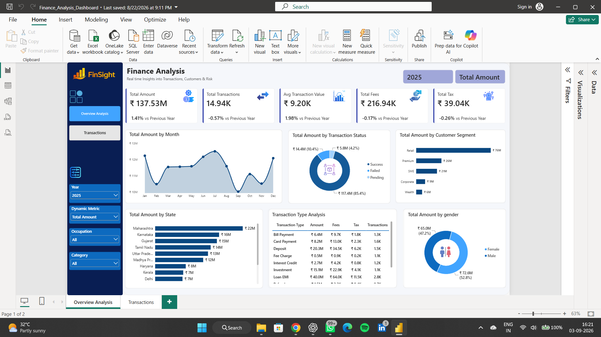
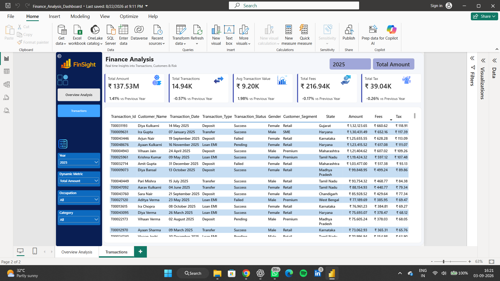

# 💰 Finance Analysis Dashboard

An end-to-end Finance Analytics project analyzing **50,069 financial transactions** from **5,000 customers** across India, using **Power BI** to uncover transaction performance, customer segments, channel usage, fraud risk, and actionable business insights.

---

## 📌 Project Overview

This project analyzes financial transaction and customer data to understand overall transaction performance, customer demographics, transaction behavior, channel adoption, fraud patterns, risk levels, and pending transactions.

The project transforms raw financial data into an interactive Power BI dashboard designed to support data-driven business decisions.

## Dashboard Screenshot




**Workflow:**
CSV Data → Data Preparation → Power BI → Dashboard → Insights & Recommendations

---

## 🗂️ Dataset

The project uses two datasets covering customers and financial transactions.

- **Customers:** 5,000
- **Geographical coverage:** India
- **Transactions:** 50,069
- **Transaction types:** 10
- **Transaction channels:** 7

**Key areas analyzed:**

| Category | Areas |
|---|---|
| Customer | Customer segments, Occupation, State |
| Transactions | Transaction type, Transaction amount |
| Channels | Branch, UPI, ATM, Net Banking, POS, Auto Debit, Mobile App |
| Risk | Risk Score, Risk Category |
| Fraud | Fraud Transactions, Fraud Rate |
| Status | Successful, Pending and other transaction statuses |
| Finance | Transaction Volume, Fees, Average Transaction Value |

---

## 🧹 Data Preparation & Quality

The analysis identified several data-quality issues in the source data:

1. **Channel inconsistencies** – Different naming conventions were identified in channel values.
2. **Currency inconsistency** – Currency values contained case differences such as INR and inr.
3. **Column naming issue** – The `fisrt_name` column contains a spelling error.
4. **Pending transactions** – 2,036 transactions require further investigation.

---

## 📊 Power BI Dashboard

`Finance_Analysis_Dashboard.pbix` — an interactive dashboard with filters for **Customer Segment, State, Transaction Type, and Channel**, featuring:

- KPI cards: ₹456 Cr transaction volume, 50,069 transactions, 5,000 customers, 85.7% success rate
- Customer segment & state-wise distribution
- Transaction type and channel usage analysis
- Fraud and risk assessment visuals
- Pending transaction monitoring
- Business recommendations panel


### Key KPIs

| KPI | Value |
|---|---|
| Transaction Volume | ₹456 Cr |
| Total Transactions | 50,069 |
| Customers | 5,000 |
| Transaction Success Rate | 85.7% |
| Fraud Rate | 1.26% |
| Average Transaction | ₹9,110 |
| Fraud Transactions | 632 |
| Pending Transactions | 2,036 |
| Average Risk Score | 36.1 / 100 |

---

## 🔑 Key Insights

- **Strong transaction volume:** ₹456 Cr in transaction volume across 50,069 transactions.
- **Diverse customer base:** Retail customers represent the largest segment at **54.1%**, followed by Premium (17.9%) and SME (15.6%).
- **Diversified channel usage:** Transaction activity is fairly evenly distributed across seven channels — Branch (7,236), UPI (7,206), ATM (7,185), Net Banking (7,125), POS (7,119), Auto Debit (7,084), and Mobile App (6,344).
- **Loan EMI leadership:** Loan EMI is the highest-volume transaction type with **9,140** transactions, followed by Transfer (8,479) and Card Payment (5,329).
- **Low fraud rate:** 632 transactions are classified as fraudulent, representing just **1.26%** of total transactions, with a clean transaction rate of 98.74%.
- **Pending transaction opportunity:** 2,036 transactions (4.1%) require investigation.
- **Data quality opportunity:** Channel naming, currency formatting, and column naming inconsistencies were identified.
- **Growth opportunity:** Premium and Wealth segments provide potential opportunities for targeted financial products.
- **Mobile adoption opportunity:** Mobile App transactions (6,344) are lower than the other major transaction channels.

---

## 💡 Business Recommendations

- **Resolve Pending Transactions** – Investigate the 2,036 pending transactions and introduce improved retry mechanisms and alerting processes to reduce transaction backlogs.
- **Improve Data Quality** – Standardize channel names, normalize currency values to INR, and correct column naming inconsistencies.
- **Target High-Value Customer Segments** – Develop targeted financial products and services for Premium and Wealth customers.
- **Increase Mobile App Adoption** – Launch targeted campaigns to improve Mobile App adoption and reduce dependency on physical branches.

---

## 🛠️ Tech Stack

| Tool | Purpose |
|---|---|
| Power BI | Interactive dashboard & visualization |
| Power Query | Data preparation & transformation |
| DAX | KPI calculations & business metrics |
| CSV | Source datasets |
| PowerPoint | Project presentation |

---

## 📁 Repository Structure

```
├── customers.csv
├── finance_transactions.csv
├── Finance_Analysis_Dashboard.pbix
├── Finance_Analysis_Presentation.pptx
├── screenshots/
│   ├── dashboard-1.png
│   └── dashboard-2.png
└── README.md
```

---

## 🚀 How to Reproduce

1. Clone the repository.
2. Download/open the provided CSV datasets (`customers.csv`, `finance_transactions.csv`).
3. Open `Finance_Analysis_Dashboard.pbix` using Power BI Desktop.
4. If required, update the dataset file paths in Power Query.
5. Refresh the data.
6. Explore the dashboard using the available visuals and filters.
7. Review `Finance_Analysis_Presentation.pptx` for the project summary and recommendations.

---

## 📄 License

This project is open-sourced for learning and portfolio purposes. Feel free to fork and build upon it.
